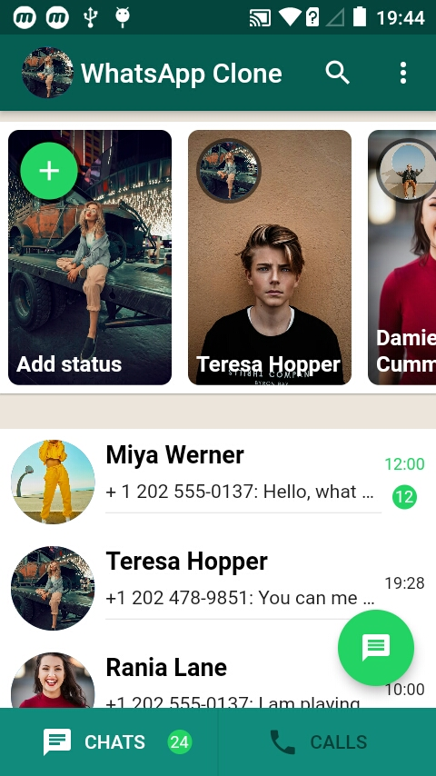
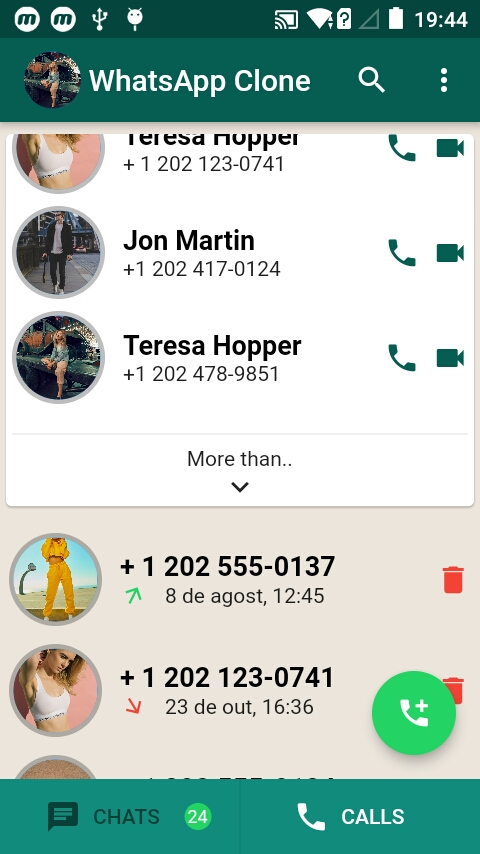

# whatsapp_clone

Re-creating the whatsapp interface.
<!-- 


 -->
![01]

Execute the commanded ``` flutter doctor ``` at your terminal.

To create a flutter project run the command.
```
    flutter create my_app
    cd my_app
    flutter run
```

You can run the command ``` flutter build ``` to build the app.

You can also use the command ``` flutter install ``` to install the app on your emulator.

## Getting Started

This project is a starting point for a Flutter application.

A few resources to get you started if this is your first Flutter project:

- [Lab: Write your first Flutter app](https://flutter.dev/docs/get-started/codelab)
- [Cookbook: Useful Flutter samples](https://flutter.dev/docs/cookbook)

For help getting started with Flutter, view our
[online documentation](https://flutter.dev/docs), which offers tutorials,
samples, guidance on mobile development, and a full API reference.
