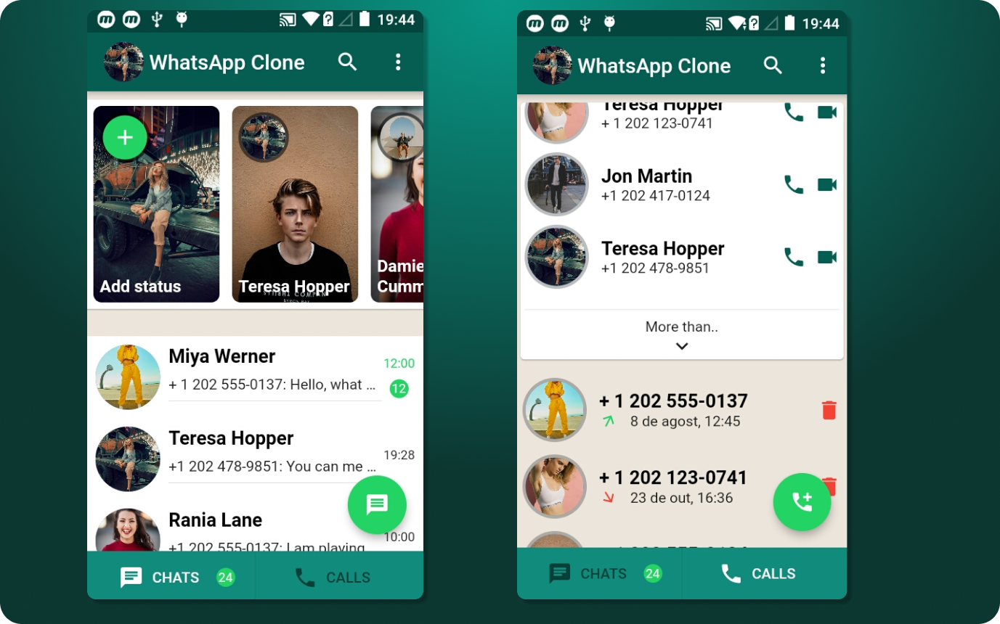

<h1 align="center">
  <br>
   Messages and Call 
  <br>
</h1>

 <h4 align="center">To start using the flutter you can access <a href="https://flutter.dev" target="_blank">Flutter</a>.</h4>
 <h3>Whatsapp-Clone: recreating the famous whatsapp app.</h3>

 <p float="left">
  
 </p>

Execute the commanded ``` flutter doctor ``` at your terminal.

To create a flutter project run the command.
```
    flutter create my_app
    cd my_app
    flutter run
```

You can run the command ``` flutter build ``` to build the app.

You can also use the command ``` flutter install ``` to install the app on your emulator.
